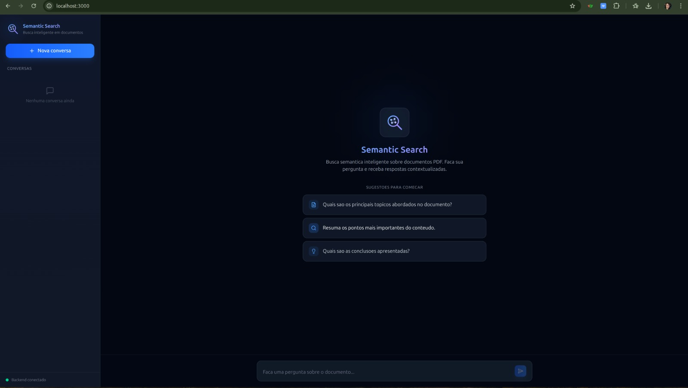
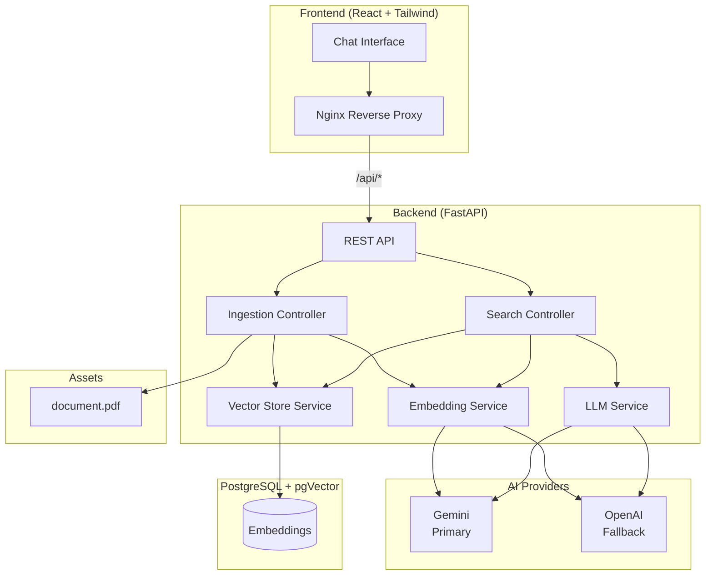
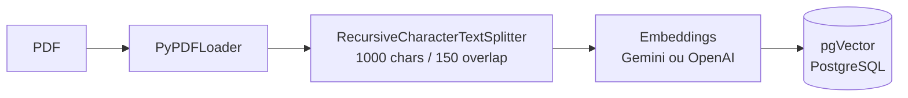
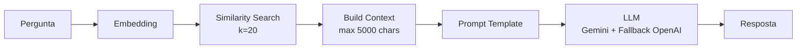

# Semantic Search

<p align="center">
  
</p>

<p align="center">
  
  
  
  
  
  
  
  
  
</p>

Sistema de busca semantica sobre documentos PDF utilizando RAG (Retrieval-Augmented Generation). Ingere PDFs, gera embeddings vetoriais e responde perguntas com base exclusivamente no conteudo do documento, usando LLMs (Gemini ou OpenAI) com PostgreSQL + pgVector como vector store.

<p align="center">
  
</p>

---

## Indice

- [Arquitetura](#arquitetura)
- [Stack Tecnologica](#stack-tecnologica)
- [Estrutura do Projeto](#estrutura-do-projeto)
- [Quick Start](#quick-start)
- [Comandos Disponiveis](#comandos-disponiveis)
- [API Reference](#api-reference)
- [Testes](#testes)
- [Configuracao](#configuracao)
- [Documentacao Adicional](#documentacao-adicional)
- [Licenca](#licenca)

---

## Arquitetura

### Visao Geral



### Pipeline de Ingestao



1. O PDF e carregado e dividido em chunks de 1000 caracteres com 150 de overlap
2. Cada chunk e convertido em embedding vetorial pelo provider configurado
3. Os vetores sao armazenados no PostgreSQL com a extensao pgVector
4. Ingestoes subsequentes limpam a collection antes de armazenar (sem contaminacao)

### Pipeline de Busca



1. A pergunta do usuario e convertida em embedding
2. pgVector executa busca por similaridade (k=20 chunks mais relevantes)
3. Os chunks sao concatenados em um contexto de ate 5000 caracteres
4. O contexto e a pergunta alimentam o prompt template
5. O LLM gera a resposta baseada exclusivamente no contexto do documento

---

## Stack Tecnologica

| Camada       | Tecnologia                                                        |
| ------------ | ----------------------------------------------------------------- |
| Backend      | Python 3.12, FastAPI, LangChain 0.3                               |
| Frontend     | React 19, TypeScript, Tailwind CSS 4.1, Vite 6                   |
| Embeddings   | Gemini (gemini-embedding-001) ou OpenAI (text-embedding-3-small)  |
| LLM          | Gemini (gemini-2.5-flash-lite) ou OpenAI (gpt-5-nano)            |
| Vector Store | PostgreSQL 17 + pgVector                                          |
| Infra        | Docker Compose, Nginx, multi-stage Dockerfile                     |
| Testes       | pytest, 305 testes unitarios com mocks                            |

---

## Estrutura do Projeto

```
fullcycle-semantic-search/
├── backend/
│   ├── Dockerfile                   # Multi-stage (deps -> test -> runner)
│   ├── entrypoint.sh                # dev | prod | test | ingest | health
│   ├── app/
│   │   ├── main.py                  # FastAPI app factory
│   │   ├── config.py                # Settings (pydantic-settings)
│   │   ├── exceptions.py            # Custom exceptions
│   │   ├── routes/
│   │   │   ├── health_route.py      # GET /health
│   │   │   ├── ingestion_route.py   # POST /api/ingest
│   │   │   └── search_route.py      # POST /api/search
│   │   ├── controllers/
│   │   │   ├── ingestion_controller.py
│   │   │   └── search_controller.py
│   │   ├── schemas/
│   │   │   ├── search.py            # SearchRequest, SearchResponse
│   │   │   └── ingestion.py         # IngestResponse
│   │   ├── services/
│   │   │   ├── embedding_service.py
│   │   │   ├── llm_service.py       # Prompt template + chain
│   │   │   ├── vector_store_service.py
│   │   │   └── providers/
│   │   │       ├── base.py          # Provider ABC
│   │   │       ├── gemini.py        # GeminiProvider
│   │   │       └── openai.py        # OpenAIProvider
│   │   └── middleware/
│   │       ├── error_handler.py
│   │       └── logging_middleware.py
│   └── tests/                       # 305 testes unitarios
│       ├── test_config.py
│       ├── test_exceptions.py
│       ├── schemas/
│       ├── controllers/
│       ├── services/
│       ├── middleware/
│       └── routes/
├── frontend/
│   ├── Dockerfile                   # Multi-stage (Node build -> Nginx)
│   ├── nginx.conf                   # Reverse proxy para backend
│   ├── package.json
│   ├── vite.config.ts
│   ├── tsconfig.json
│   ├── index.html
│   ├── public/
│   │   └── logo.svg
│   └── src/
│       ├── main.tsx
│       ├── App.tsx
│       ├── api.ts                   # Client HTTP (health, search)
│       ├── types.ts                 # Message, Conversation, HealthStatus
│       ├── hooks/
│       │   ├── useConversations.ts  # Estado com localStorage
│       │   └── useHealth.ts         # Polling do backend
│       └── components/
│           ├── Sidebar.tsx          # Branding, lista de conversas, status
│           ├── ChatArea.tsx         # Area principal de mensagens
│           ├── ChatInput.tsx        # Input com auto-resize
│           ├── MessageBubble.tsx    # Bubbles com markdown
│           └── EmptyState.tsx       # Tela inicial com sugestoes
├── cli/
│   ├── cli.py                       # Chat direto (testa pipeline sem API)
│   └── api_cli.py                   # Chat via HTTP (testa API completa)
├── assets/
│   └── document.pdf                 # PDF para ingestao
├── docs/
│   ├── api-curl-examples.md         # Exemplos de uso com curl
│   └── postman/                     # Collection + Environment Postman
├── docker-compose.yml               # postgres + backend + frontend
├── Makefile                         # Comandos automatizados
├── requirements.txt                 # Deps backend (producao)
├── requirements-dev.txt             # Deps backend (dev/test)
├── .env.example                     # Template de variaveis
└── README.md
```

---

## Quick Start

### Pre-requisitos

- Docker e Docker Compose
- Chave de API do Google Gemini (ou OpenAI)

### 1. Clone e configure

```bash
git clone https://github.com/LucasBiason/fullcycle-semantic-search.git
cd fullcycle-semantic-search
cp .env.example .env
```

Edite o `.env` e preencha a `GOOGLE_API_KEY` (ou `OPENAI_API_KEY`).

### 2. Suba o sistema completo

```bash
make up
```

Esse comando builda as imagens Docker e sobe todos os containers:

| Servico    | URL                    | Descricao                    |
| ---------- | ---------------------- | ---------------------------- |
| Frontend   | http://localhost:3000   | Interface de chat (React)    |
| Backend    | http://localhost:8000   | API REST (FastAPI)           |
| PostgreSQL | localhost:5432          | Banco de dados + pgVector    |

### 3. Ingira o PDF

```bash
# Via API (com o backend rodando):
curl -X POST http://localhost:8000/api/ingest

# Ou via Makefile (local):
make ingest
```

### 4. Use

Acesse http://localhost:3000 e faca perguntas sobre o documento.

### Parar

```bash
make down
```

---

### Setup Local (sem Docker para o app)

Para desenvolvimento local sem containers do app (apenas PostgreSQL no Docker):

```bash
make setup          # Cria venv, instala deps, sobe PostgreSQL
source venv/bin/activate

make ingest         # Ingere o PDF
make serve          # Sobe o backend (porta 8000)
make web            # Sobe o frontend em dev mode (porta 3000)
```

Para o frontend local, e necessario ter Node.js 22+ instalado. Na primeira vez:

```bash
cd frontend && npm install
```

---

## Comandos Disponiveis

```bash
make help           # Lista todos os comandos
```

| Comando          | Descricao                                       |
| ---------------- | ----------------------------------------------- |
| `make up`        | Builda e sobe todos os containers               |
| `make down`      | Para e remove os containers                     |
| `make build`     | Builda as imagens Docker                        |
| `make logs`      | Acompanha logs dos containers                   |
| `make setup`     | Setup local (venv + deps + PostgreSQL)          |
| `make install`   | Instala dependencias de producao                |
| `make install-dev` | Instala dependencias de desenvolvimento       |
| `make db-up`     | Sobe apenas o PostgreSQL + pgVector             |
| `make db-down`   | Para o PostgreSQL                               |
| `make db-reset`  | Reseta o banco (apaga volume e recria)          |
| `make ingest`    | Ingere o PDF no vector store                    |
| `make chat`      | Chat CLI direto (sem API)                       |
| `make chat-api`  | Chat CLI via API HTTP                           |
| `make serve`     | Sobe o backend em modo dev (hot reload)         |
| `make web`       | Sobe o frontend em modo dev                     |
| `make run`       | Ingere + sobe o backend                         |
| `make test`      | Roda testes unitarios localmente                |
| `make test-docker` | Roda testes dentro do container               |
| `make build-test` | Builda o stage de teste da imagem              |
| `make clean`     | Remove __pycache__ e .pyc                       |

---

## API Reference

### Health Check

```
GET /health
```

```json
{
  "status": "healthy",
  "provider": "Gemini",
  "collection": "document_embeddings",
  "timestamp": "2026-03-11T12:28:27.542664+00:00"
}
```

### Ingestao de PDF

```
POST /api/ingest
```

```json
{
  "status": "success",
  "message": "PDF ingested successfully",
  "pdf_path": "assets/document.pdf",
  "chunks_stored": 67
}
```

### Busca Semantica

```
POST /api/search
Content-Type: application/json

{
  "question": "Quais empresas estao listadas no documento?",
  "k": 20
}
```

```json
{
  "answer": "O documento lista empresas como Helix, Lunar, Orbital..."
}
```

Parametros:
- `question` (string, obrigatorio): pergunta com 3 a 5000 caracteres
- `k` (int, opcional): quantidade de chunks para contexto (1 a 50, padrao 20)

Para exemplos detalhados com curl, veja [docs/api-curl-examples.md](docs/api-curl-examples.md).

---

## Testes

O projeto possui **305 testes unitarios** cobrindo todo o backend. Os testes utilizam mocks para isolar cada unidade, sem dependencia de banco de dados ou APIs externas.

### Executar testes

```bash
# Local (com venv ativado):
make test

# Dentro do Docker:
make test-docker
```

### Estrutura dos testes

Os testes espelham a hierarquia do codigo-fonte:

```
backend/tests/
├── test_config.py                  # 19 testes - Settings e variaveis
├── test_exceptions.py              # 21 testes - Exceptions customizadas
├── schemas/
│   ├── test_search.py              # SearchRequest, SearchResponse
│   └── test_ingestion.py           # IngestResponse
├── controllers/
│   ├── test_ingestion_controller.py  # 25 testes - Pipeline de ingestao
│   └── test_search_controller.py     # Busca, contexto, guardrails
├── services/
│   ├── test_embedding_service.py   # EmbeddingService + factory
│   ├── test_llm_service.py         # LLMService, chain, fallback
│   ├── test_vector_store_service.py  # PGVector operations
│   └── providers/
│       ├── test_gemini.py          # GeminiProvider
│       ├── test_openai.py          # OpenAIProvider
│       └── test_factory.py         # create_provider, create_fallback
├── middleware/
│   ├── test_error_handler.py       # Exception middleware
│   └── test_logging_middleware.py  # Request/response logging
└── routes/
    ├── test_health_route.py        # GET /health
    ├── test_ingestion_route.py     # POST /api/ingest
    └── test_search_route.py        # POST /api/search
```

### Convenções dos testes

- Um arquivo de teste por modulo do app
- Todas as dependencias externas (banco, APIs, filesystem) sao mockadas
- Cada teste valida uma unica funcao ou comportamento
- Nomes descritivos: `test_ask_returns_answer_from_chain`
- Coverage target: 100%

---

## Configuracao

Todas as variaveis de ambiente ficam no `.env` (copie de `.env.example`):

| Variavel                    | Descricao                    | Default                               |
| --------------------------- | ---------------------------- | ------------------------------------- |
| `GOOGLE_API_KEY`            | Chave da API Gemini          | -                                     |
| `GOOGLE_EMBEDDING_MODEL`    | Modelo de embedding Gemini   | `models/gemini-embedding-001`         |
| `GOOGLE_LLM_MODEL`          | Modelo LLM Gemini            | `gemini-2.5-flash-lite`               |
| `OPENAI_API_KEY`            | Chave da API OpenAI (fallback) | -                                   |
| `OPENAI_EMBEDDING_MODEL`    | Modelo de embedding OpenAI   | `text-embedding-3-small`              |
| `OPENAI_LLM_MODEL`          | Modelo LLM OpenAI            | `gpt-5-nano`                          |
| `DATABASE_URL`              | String de conexao PostgreSQL | `postgresql+psycopg://...@localhost`  |
| `PG_VECTOR_COLLECTION_NAME` | Nome da collection           | `document_embeddings`                 |
| `PDF_PATH`                  | Caminho do PDF               | `assets/document.pdf`                 |

### Providers

Se `GOOGLE_API_KEY` estiver definida, Gemini sera o provider primario. Se `OPENAI_API_KEY` tambem estiver definida, OpenAI sera usado como fallback automatico quando Gemini falhar. O inverso tambem funciona.

### Docker vs Local

- **Docker** (`make up`): o `DATABASE_URL` e sobrescrito automaticamente no `docker-compose.yml` para usar o hostname `postgres`
- **Local** (`make setup`): use `DATABASE_URL` com `localhost` no `.env`

---

## Documentacao Adicional

| Documento | Descricao |
| --------- | --------- |
| [docs/api-curl-examples.md](docs/api-curl-examples.md) | Exemplos de uso da API com curl |
| [docs/postman/](docs/postman/) | Collection e Environment para Postman |
| [.env.example](.env.example) | Template de variaveis de ambiente |

---

## Licenca

MIT License

---

_Por Lucas Biason - MBA Full Cycle Software Engineering with AI_
